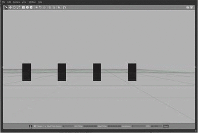

# Physics benchmarks using the Gazebo Simulator

Documentation for physics benchmarks in the [Gazebo-classic simulator](http://classic.gazebosim.org).
This folder contains documentation for several multibody benchmark problems
in iPython notebook format.
These documents can be viewed online in the following locations
or on your own machine following the instructions given below:

* [Boxes: free-floating rigid bodies](boxes_description.ipynb)

These benchmarks can be run for the physics engines supported by gazebo:

* [Open Dynamics Engine (ODE)](http://ode.org), (source code on [bitbucket](https://bitbucket.org/odedevs/ode))
* [Bullet](https://pybullet.org/), (source code on [github](https://github.com/bulletphysics/bullet3))
* [Simbody](https://simtk.org/home/simbody), (source code on [github](https://github.com/simbody/simbody))
* [Dynamic Animation and Robotics Toolkit (DART)](http://dartsim.github.io), (source code on [github](https://github.com/dartsim/dart))

The benchmarks tests are hosted in the
[scpeters/benchmark](https://github.com/scpeters/benchmark)
repository on github.
There are several plots and presentations in the
[pdf folder](https://github.com/scpeters/benchmark/tree/master/pdf),
including presentations from
[ROSCon 2014](https://github.com/scpeters/benchmark/blob/master/pdf/roscon2014_scpeters.pdf)
([video](https://vimeo.com/107517366))
and [Multibody 2015](https://github.com/scpeters/benchmark/blob/master/pdf/multibody2015_scpeters.pdf).

# Instructions

To run the tests,
[build or install gazebo 6 or later
with the optional physics engines](https://classic.gazebosim.org/tutorials?tut=install_from_source&cat=install#OptionalPhysicsEngines),
and then clone and build the benchmarks:

~~~
git clone https://github.com/scpeters/benchmark
pip install lz4 protobuf zstandard
cd benchmark
git submodule update --init --recursive
mkdir build
cd build
cmake ..
make
make test
~~~

Once the tests are completed,
they will create time-stamped csv files in the `test_results` folder of the git repository.

To load and visualize the test results, you should make sure ipython notebook, matplotlib, and numpy are installed on your machine:
~~~
# Ubuntu Precise: do this step first
# Trusty uses ipython 1.2.1, use ppa on Precise to get the newer version
sudo apt-add-repository ppa:jtaylor/ipython

# Ubuntu Precise and Trusty
sudo apt-get install ipython-notebook python-matplotlib python-numpy

# Mac
brew install matplotlib
# do the following in specific terminals when using ipython notebook
export PYTHONPATH=/usr/local/lib/python2.7/site-packages
~~~

With the proper dependencies installed run ipython notebook from the
root of the git repository and open the
[boxes_results notebook](http://nbviewer.ipython.org/github/scpeters/benchmark/blob/master/boxes_results.ipynb):

~~~
ipython notebook
~~~
